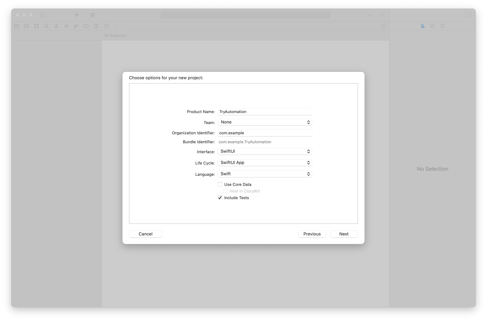
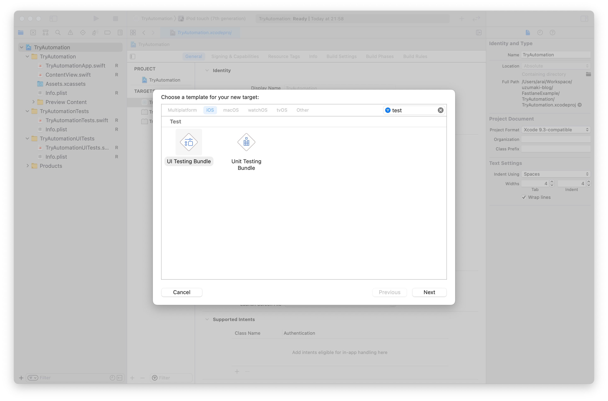
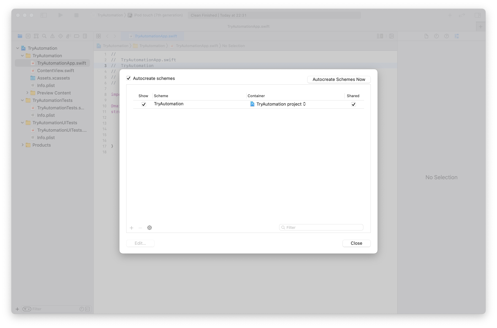

### 1. プロジェクトにXCTestとXCUITestを追加する。

Xcodeプロジェクトを作成する際は`Include Tests`を選択します。  
作成済みのプロジェクトの場合は、Targetの`Unit Testing Bundle`と`UI Testing Bundle`を追加します。  

これは第5章で話に触れる、fastlane/scanを実行する際に使用するテストになります。




### 2. fastlaneの動作環境を整えるために各種ソフトウェアをインストールします。

[Setup - fastlane docs](https://docs.fastlane.tools/getting-started/ios/setup/) を参考にご自身で環境構築しても良いですが、この記事ではPCの環境を極力汚さない方法を選びながら説明します。

2-1.

[Homebrew](https://brew.sh/index_ja) のインストールがまだの場合は、まずこのスクリプトをターミナルで実行します。

```bash
/bin/bash -c "$(curl -fsSL https://raw.githubusercontent.com/Homebrew/install/HEAD/install.sh)"
```

2-2.

本来は後述の手順を踏んで各種ソフトウェアをインストールする必要があるのですが、この記事では [fast-ruby-install](https://github.com/Tea-and-Coffee/fast-ruby-install) のスクリプトを用いてまとめてインストールと環境構築を行います。

**(本来の大まかなインストール手順)**

- Homebrewで、[rbenv](https://github.com/rbenv/rbenv)と[rbenv/ruby-build](https://github.com/rbenv/ruby-build)をインストールする。  
- rbenvで、[ruby](https://github.com/ruby/ruby)及び[rubygems](https://github.com/rubygems/rubygems)をインストールする。  
- rubygemsで、[bundler](https://github.com/rubygems/rubygems/tree/master/bundler)をインストールする。

`--ruby 2.7.3` `--gem 3.2.28` `--bundlers 2.2.28` にインストールしたいソフトウェアバージョンを指定して、ターミナルで実行します。  
この記事ではrubyは2.7.3、rubygemsとbundlerは最新バージョンの3.2.28と2.2.28に指定しています。

```bash
curl -fsSL https://raw.githubusercontent.com/Tea-and-Coffee/fast-ruby-install/master/install.sh | bash -s -- --ruby 2.7.3 --gem 3.2.28 --bundlers 2.2.28
```

2-3.

プロジェクト内で使用するrubyバージョンを指定するため、`.ruby-version`ファイルを作成してバージョンを記述します。

```bash
echo "2.7.3" > .ruby-version

```

2-4.

続いてbundlerの設定ファイルを作成します。  
実行後に`Gemfile`というテキストファイルが作成されます。

```bash
bundle init
```

2-5.

`Gemfile`をテキストとして開き、後述を参考に編集します。この記事では現状の最終バージョンを指定しています。  
詳細なバージョン指定方法については知りたい場合は [Bundler: gemfile](https://bundler.io/man/gemfile.5.html) を参照して下さい。

```
source "https://rubygems.org"

gem "fastlane", "~> 2.195.0"
```

[CocoaPods](https://github.com/CocoaPods/CocoaPods)や[xcpretty/xcode-install](https://github.com/xcpretty/xcode-install)もインストールする場合はこの様になります。

```
source "https://rubygems.org"

gem "fastlane", "~> 2.195.0"
gem "cocoapods", "~> 1.11.2"
gem "xcode-install", "~> 2.8"
```

2-6.

`Gemfile`の編集が済んだら、Gemfileに記載のソフトウェアをインストールするために実行します。

```bash
bundle install
```

`vendor/bundle`配下にgem（fastlaneやその依存関係のあるRubyのプログラム）がインストールされますので、必要に応じて`.gitignore`に`vendor/`を追記します。

### 3. fastlaneのセットアップ

fastlaneの動作環境が整いましたので、fastlaneのセットアップを行います。

3-1.

fastlaneの初期ファイルを生成します。  
bundleでインストールしたgemを実行するには、`bundle exec <gem> *`というシンタックスを用います。

```bash
bundle exec fastlane init

```

実行中の以下の様な質問には、"Manual setup"の`4`を入力し、Enterキーを投下します。

```bash
What would you like to use fastlane for?
1. 📸  Automate screenshots
2. 👩‍✈️  Automate beta distribution to TestFlight
3. 🚀  Automate App Store distribution
4. 🛠  Manual setup - manually setup your project to automate your tasks
```

その後も3回ほどEnterキーを求めれるので、Enterキーを投下します。

```bash
Continue by pressing Enter
```

最後まで実行が完了すると、`fastlane`配下に`Appfile`, `Fastfile`が生成されます。

3-2.

手始めに`Fastfile`を開き、`before_all` block, `after_all` block, `error` blockを追加します。  
レーンを実行した際にそれぞれ、レーン実行前・レーン実行後後・エラー発生時に呼ばれるblockになります。

各blockの公式情報は[Fastfile - fastlane docs](https://docs.fastlane.tools/advanced/Fastfile/)になります。

```ruby
# This file contains the fastlane.tools configuration
# You can find the documentation at https://docs.fastlane.tools
#
# For a list of all available actions, check out
#
#     https://docs.fastlane.tools/actions
#
# For a list of all available plugins, check out
#
#     https://docs.fastlane.tools/plugins/available-plugins
#

default_platform(:ios)

platform :ios do

  before_all do |lane|
  end

  after_all do |lane|
  end

  error do |lane, exception|
  end

end
```

### 4. Xcodeバージョンの確認をする

fastlaneを実行する際にXcodeバージョンが正しいか確認してから実行したい場合は、`.xcode-version`ファイルを作成し、`before_all` blockにfastlane/[ensure_xcode_version](https://docs.fastlane.tools/actions/ensure_xcode_version/)を追記します。

ensure_xcode_versionにはこれらの効果があるので追記することを強くおすすめします。

- チームメンバー内で使用するXcodeバージョンを統一する。
- プロダクト毎に違うバージョンを使用している場合に、バージョン切り替え忘れを防ぐ。
- ローカルマシンとCIで使用しているバージョンが違う場合に検知出来る。

```bash
echo "12.5.1" > .xcode-version

```

```ruby
  before_all do |lane|
    ensure_xcode_version
  end

```

### 5. テストを実行する

ビルドが通り、テストが成功するかを自動化したいと思います。

5-1.

テストを実行するには、fastlane/[scan](https://docs.fastlane.tools/actions/scan/)を用います。

projectには.xcodeprojのファイルパス。schemeとconfigurationにはテスト実行時に使用している環境を指定します。  
環境変数が不明な場合は`xcodebuild -list -json`を実行すると出力されるので、その中から選ぶ様にします。  
なおcleanにtrue指定すると、実行時にクリーンビルドになります。

```ruby
  lane :test do |options|
    scan(
      project: "TryAutomation.xcodeproj",
      scheme: "TryAutomation",
      configuration: "Debug",
      clean: true
    )
  end
```

※ CocoaPodsを使用している等の理由で`*xcworkspace`ファイルがある場合は、"projectとxcodeproj"の部分が"workspaceとxcworkspace"に置き換わります。

```ruby
  lane :test do |options|
    scan(
      workspace: "TryAutomation.xcworkspace",
      scheme: "TryAutomation",
      configuration: "Debug",
      clean: true
    )
  end
```

**`xcodebuild -list -json`の出力例：**

```bash
$ xcodebuild -list -json
{
  "project" : {
    "configurations" : [
      "Debug",
      "Release"
    ],
    "name" : "TryAutomation",
    "schemes" : [
      "TryAutomation"
    ],
    "targets" : [
      "TryAutomation",
      "TryAutomationTests",
      "TryAutomationUITests"
    ]
  }
}
```

5-2.

もしschemeが共有状態になっていない場合は、"Scheme > Manage schemes..."と進み、Sharedにチェックをします。



5-3.

ここまででscanを実行する順が整いましたので、fastlaneを実行します。  
暫くすると本来実行したいlane番号の入力を求められるので、該当する数字を入力しEnterキーを投下します。

```bash
$ bundle exec fastlane
[✔] 🚀 
------------------------------
--- Step: default_platform ---
------------------------------
Welcome to fastlane! Here's what your app is set up to do:
+--------+-----------+------------------------------+
|              Available lanes to run               |
+--------+-----------+------------------------------+
| Number | Lane Name | Description                  |
+--------+-----------+------------------------------+
| 1      | ios test  |                              |
| 0      | cancel    | No selection, exit fastlane! |
+--------+-----------+------------------------------+
Which number would you like run?
```

CompileやBuildの後、テストが実行され、"Test Results"にテスト結果が出力されます。  
"fastlane summary"には今回実行したActionと実行時間の一覧が出力されます。

```bash
+--------------------+---+
|      Test Results      |
+--------------------+---+
| Number of tests    | 4 |
| Number of failures | 0 |
+--------------------+---+


+------+----------------------+-------------+
|             fastlane summary              |
+------+----------------------+-------------+
| Step | Action               | Time (in s) |
+------+----------------------+-------------+
| 1    | default_platform     | 0           |
| 2    | ensure_xcode_version | 1           |
| 3    | scan                 | 122         |
+------+----------------------+-------------+

fastlane.tools finished successfully 🎉
```
